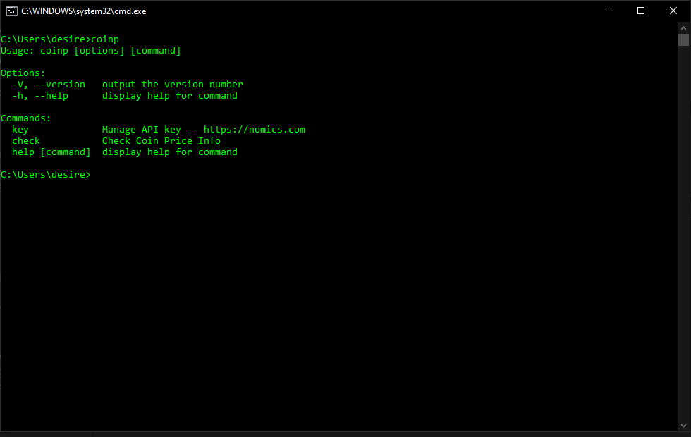
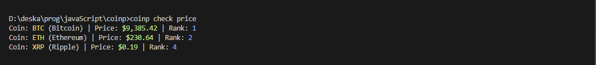
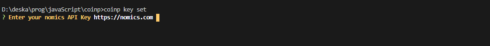
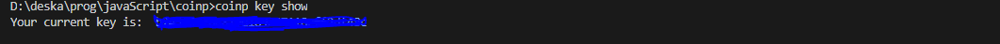
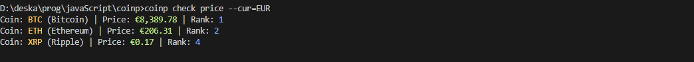
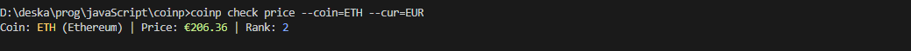

# coin-p
>A nodejs CLI for cryptocurrency prices




## Installation

1. Clone the repo into your computer

```bash
git clone https://github.com/desirekaleba/coinp.git
```

2. Navigate to the cloned folder

```bash
cd coinp
```

3. Install all required dependencies

```bash
npm install
```

4. Add coinp to your modules

```bash
npm link
```

## Usage

>Got to [nomics](https://nomics.com) and get an API key

After having your key open your terminal and follow along with me.

Type `coinp --help` OR `coinp -h` for help. And `coinp --version` OR `coinp -V` to check your coinp version.

1. Key

```bash
coinp key set
```

You will be asked to input your key



You can see your current key by typing `coinp key show`



Or remove it with `coinp key remove`

2. Price

You can check prices by typing:

```bash
coinp check price
```


> The default Currency is USD you can Specify yours too

Simply type:

```bash
coinp check price --cur=EUR
```



Where --cur stands for currency.

You can aswell specify the coin with the `--coin=[coin]` option where `[coin]` is replaced with the coin ext

```bash
coinp check price --coin=ETH --cur=EUR
```

